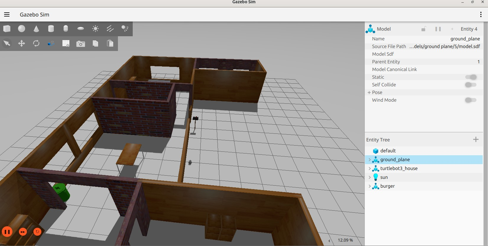
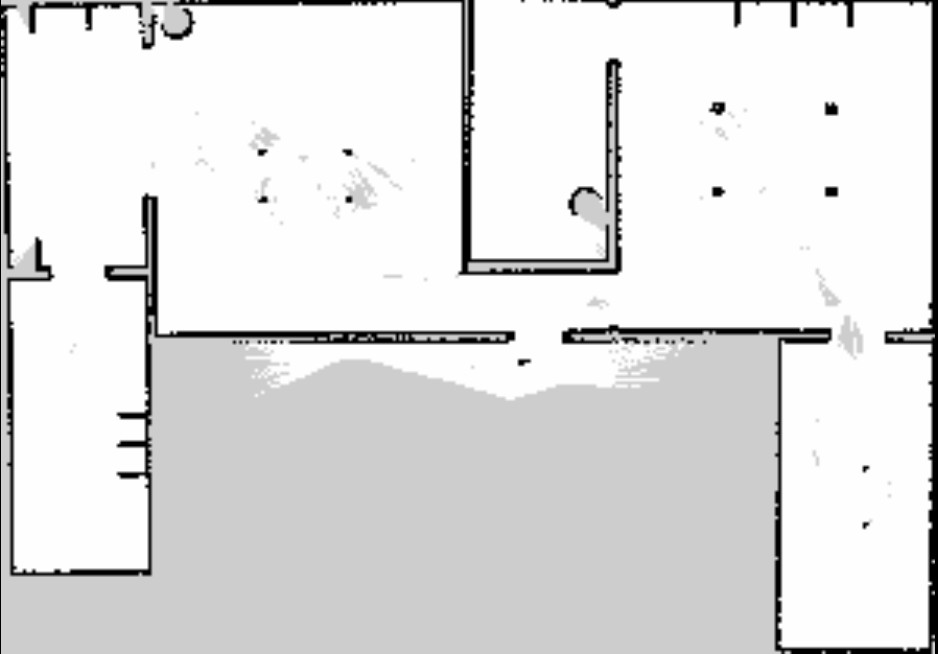
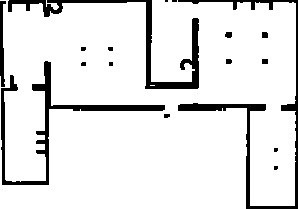
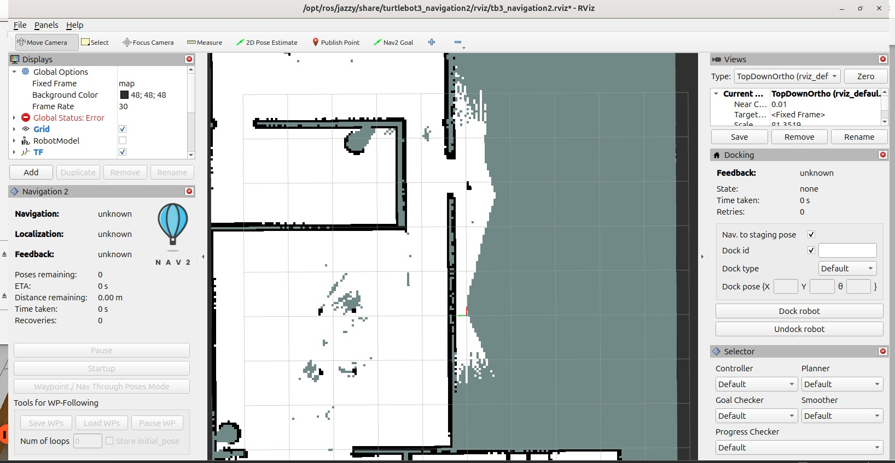
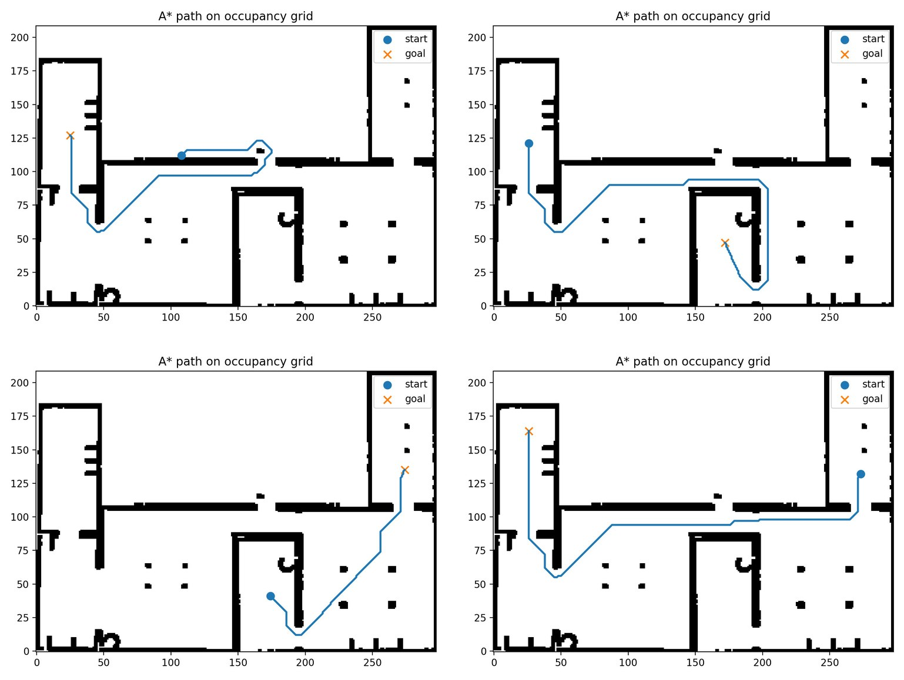
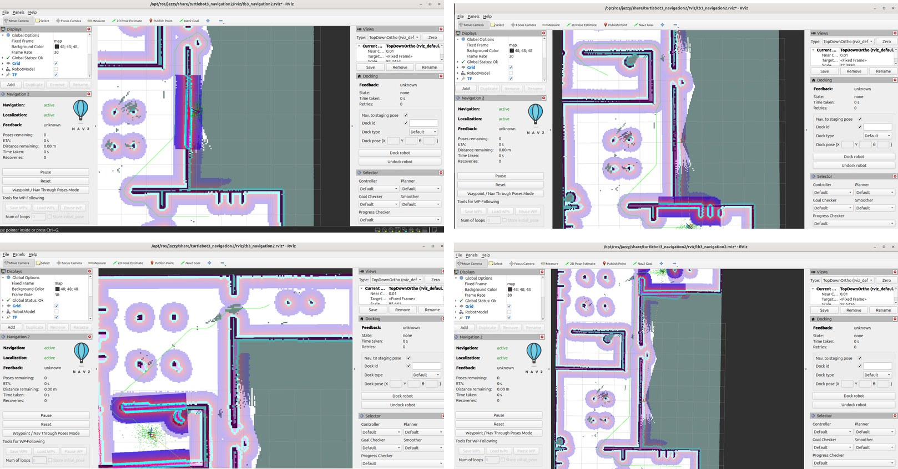
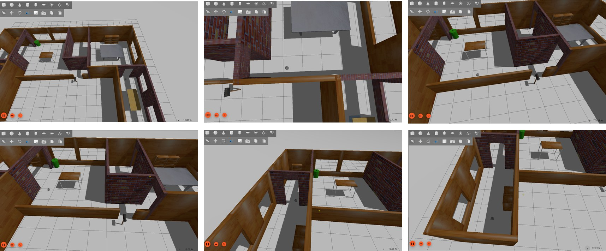
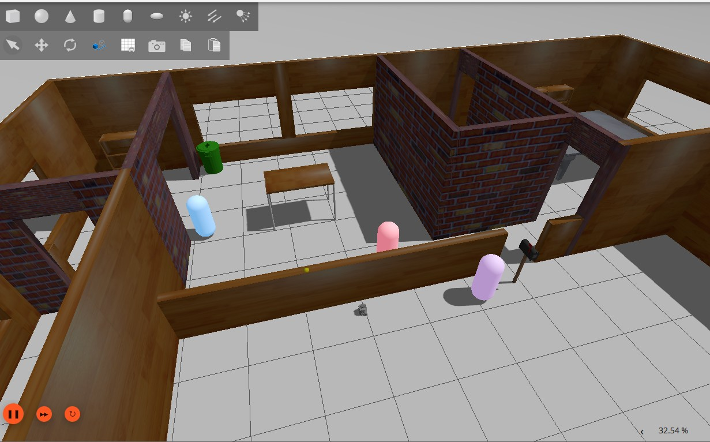
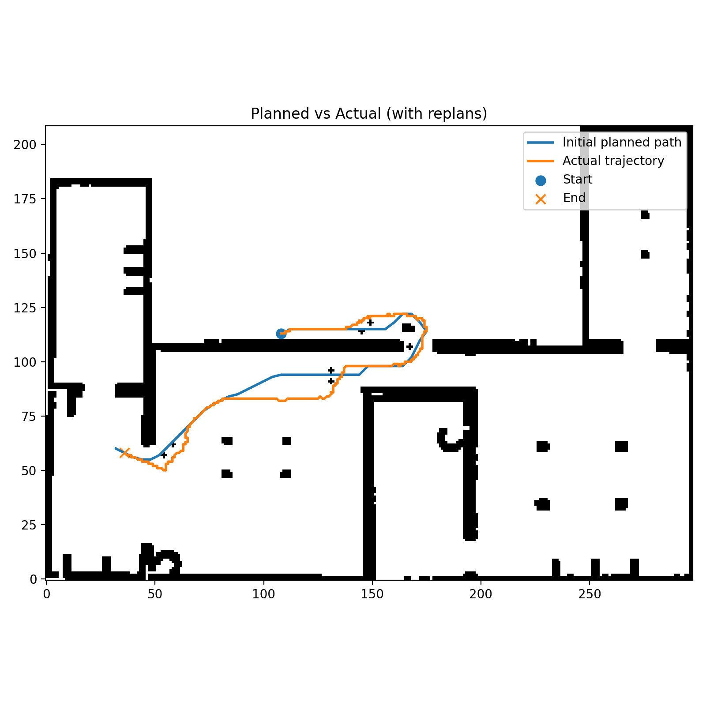
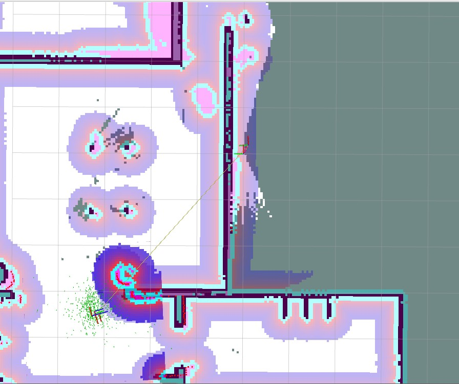

# Autonomous Vehicle Project 2

Custom ROS 2 navigation for a TurtleBot3 Burger, developed for the Autonomous
Vehicles course in the M.Sc. Mechanical Engineering program at Politecnico di
Milano (Academic Year 2025/2026).

This repository contains the project's waypoint controller.
The wider project described below combines SLAM-based mapping, a custom A* planner,
online replanning, and direct velocity control without using the Nav2 planner or
controller servers.

## Project overview

Autonomous indoor navigation requires a robot to represent its surroundings,
localize itself, plan collision-free motion, and execute that plan under kinematic
and safety constraints. This project implements that pipeline for a TurtleBot3
Burger in Gazebo:

1. Explore `turtlebot3_house` by teleoperation while SLAM Toolbox builds a 2D map.
2. Save the occupancy grid as a ROS image and YAML metadata file.
3. Preprocess the grid and inflate obstacles to account for the robot footprint.
4. Plan a safe path with a custom, safety-aware A* implementation.
5. Convert grid cells into map-frame waypoints.
6. Follow the waypoints with a custom feedback controller.
7. Detect previously unknown obstacles, update the internal grid, and replan.

The complete project is intentionally independent of Nav2's planning and control
components. Nav2 is used only to serve and visualize the saved map in RViz.

## Simulation and map generation

Experiments use the TurtleBot3 Burger in the structured `turtlebot3_house` Gazebo
world. Its rooms, corridors, walls, and narrow passages provide a useful test of
mapping, global planning, and path tracking.



*Figure 1 - Gazebo `turtlebot3_house` environment used for mapping and navigation.*

The robot is driven manually while SLAM Toolbox runs in online asynchronous mode.
Laser scans and estimated motion are fused into a probabilistic occupancy grid,
which is then saved with the ROS 2 map server. White pixels represent free space,
black pixels represent occupied cells, and gray pixels represent unknown areas.



*Figure 2 - Raw SLAM occupancy grid; gray regions are unknown.*

For this known, bounded simulation, unknown cells are reclassified as free while
occupied cells remain unchanged. The resulting binary grid uses zero for free
cells and one for obstacles. This prevents unobserved but traversable areas from
unnecessarily blocking the global planner.



*Figure 3 - Improved occupancy grid after unknown cells are reclassified as free.*

Obstacles are then inflated by a fixed radius in grid cells. Inflation accounts
for the TurtleBot3 footprint and adds a safety margin, preventing the planner from
routing through gaps that are too narrow or directly alongside walls.

The static map is loaded in RViz for visualization and target selection. A target
is selected with RViz's **Publish Point** tool; the custom navigation node consumes
that map-frame point directly.



*Figure 4 - The improved occupancy grid in RViz. Nav2 serves the map but does not
perform planning or control.*

## Planning problem

The robot configuration is

```text
q = (x, y, theta)
```

where `(x, y)` is the position in the map frame and `theta` is the robot heading.
The grid planner considers the translational components; orientation is handled
during path execution.

Given an occupancy grid, a start configuration, and a goal configuration, the
planner must find a collision-free sequence of cells that minimizes path length
and maintains useful clearance from obstacles. If a requested start or goal lies
inside an occupied cell after inflation, it is projected to the nearest free cell
within a bounded search radius.

## Safety-aware A* planner

Each free grid cell is a graph node. The planner uses an eight-connected motion
model: cardinal steps cost `1`, while diagonal steps cost `sqrt(2)`. A diagonal
transition is accepted only if its two adjacent cardinal cells are free, which
prevents unsafe corner cutting.

A* prioritizes nodes using

```text
f(n) = g(n) + h(n)
h(n) = sqrt((i - i_goal)^2 + (j - j_goal)^2)
```

Here, `g(n)` is the accumulated cost from the start and `h(n)` is the Euclidean
distance to the goal. The open set is a priority queue ordered by `f`; parent links
are updated whenever a lower-cost route to a neighbor is found. Once the goal is
expanded, those links are followed backward to reconstruct the path.

A clearance map extends the basic path-length objective. Cells closer than a
configured safety distance to an inflated obstacle receive an additional,
smoothly increasing cost. The planner therefore prefers routes with more obstacle
clearance when a safer alternative is available.

The reconstructed grid path is reversed, downsampled into waypoints, and converted
to metric coordinates for execution.



*Figure 5 - A-star paths for four start-goal configurations on the improved occupancy
grid.*

## Grid and map coordinate conversion

Image coordinates begin at the top-left, whereas ROS map coordinates use the
bottom-left convention. With map resolution `r`, origin `(x0, y0)`, grid height
`H`, row `i`, and column `j`, the cell center is transformed as

```text
x = x0 + (j + 0.5) * r
y = y0 + (H - i - 0.5) * r
```

The half-cell offset selects the cell center and the inverted row term reconciles
the two coordinate conventions. The inverse transform converts live robot and
target positions back to grid indices when replanning is required.

## Waypoint controller

The C++ node in this repository subscribes to:

- `/odom` (`nav_msgs/msg/Odometry`) for pose and measured velocity;
- `/waypoints` (`geometry_msgs/msg/PoseArray`) for the planned path.

It publishes stamped linear and angular velocity commands on `/cmd_vel` at 20 Hz.
For an active waypoint `(x_t, y_t)`, it computes

```text
d = sqrt((x_t - x)^2 + (y_t - y)^2)
theta_desired = atan2(y_t - y, x_t - x)
alpha = wrap_to_pi(theta_desired - theta)
kappa = 2 * sin(alpha) / lookahead_distance
omega = v * kappa
```

The cruise velocity is reduced near both the current waypoint and final goal.
Linear and angular speeds are saturated by `v_max` and `w_max`. If the heading
error is large, the robot turns in place before moving forward. A second recovery
condition counts consecutive cycles in which distance to the active waypoint
increases and forces realignment when that count exceeds `away_cycles`.

A waypoint is complete within `distance_tolerance`. At the final waypoint the
robot stops translating and uses proportional angular control to match the target
yaw. Completion requires the yaw error to be within `yaw_tolerance`.

## Results

Across four test routes, the planned paths avoid occupied and inflated cells. The
published paths appear as green polylines in RViz and are followed accurately by
the custom waypoint controller, including in narrow corridors and sharp turns.



*Figure 6 - Execution of the four planned paths in RViz.*



*Figure 7 - TurtleBot3 following the final planned path in Gazebo.*

### Dynamic obstacles and online replanning

Additional obstacles were inserted into Gazebo after the initial path was planned,
so they were absent from the static map. Laser data identifies newly blocked path
cells, the robot stops, and the obstacles are added to the internal grid with
inflation. A* then plans again from the current robot pose to the original goal.



*Figure 8 - Unexpected obstacles introduced after initial planning.*

The executed trajectory diverges from the original plan where replanning is
needed, then safely returns toward the goal.



*Figure 9 - Initial path compared with the actual trajectory after online replanning.*



*Figure 10 - RViz map after detected obstacles are integrated and inflated.*

The experiments demonstrate a transparent mapping-planning-control pipeline that
can respond to environmental changes without delegating planning or control to
Nav2. Current limitations include fixed grid resolution, no explicit dynamic model
inside A*, and reactive rather than predictive replanning. Natural extensions are
adaptive resolution, path smoothing, and execution-aware planning costs.

## Repository scope

This repository currently implements the **C++ waypoint-control component** of the
full pipeline described above. It expects another ROS 2 node to generate and
publish the `PoseArray`. The A* planner, scan-based obstacle integration, and map
preprocessing discussed in the report are project context and are not implemented
in this package.

## Code organization

The controller is split by responsibility instead of being kept in one source file:

| File | Responsibility |
|---|---|
| `include/turtlebot3_waypoint_controller/types.hpp` | Shared waypoint, robot-pose, and telemetry data types |
| `include/turtlebot3_waypoint_controller/controller_math.hpp` | Public interface for geometry and controller math |
| `src/controller_math.cpp` | Angle conversion, clamping, lookahead, and cross-track calculations |
| `include/turtlebot3_waypoint_controller/telemetry_logger.hpp` | CSV logger interface |
| `src/telemetry_logger.cpp` | Telemetry storage and CSV serialization |
| `include/turtlebot3_waypoint_controller/odom_listener.hpp` | ROS controller node declaration and state |
| `src/odom_listener.cpp` | Parameters, callbacks, command publication, and control loop |
| `src/main.cpp` | ROS initialization and node startup |

## Requirements

- ROS 2 Humble or newer
- `rclcpp`, `geometry_msgs`, and `nav_msgs`
- TurtleBot3 Gazebo packages for the included launch file

## Build

Clone this repository into the `src` directory of a ROS 2 workspace:

```bash
cd ~/ros2_ws/src
git clone https://github.com/Gianluca3103/Autonomous-Vehicle-Projects.git \
  turtlebot3_waypoint_controller
cd ..
rosdep install --from-paths src --ignore-src -r -y
colcon build --packages-select turtlebot3_waypoint_controller
source install/setup.bash
```

## Run

Start Gazebo and the controller together:

```bash
ros2 launch turtlebot3_waypoint_controller project2.launch.py
```

Or run only the controller:

```bash
ros2 run turtlebot3_waypoint_controller project2_controller
```

Publish a simple two-waypoint path:

```bash
ros2 topic pub --once /waypoints geometry_msgs/msg/PoseArray \
  "{header: {frame_id: 'odom'}, poses: [
    {position: {x: 1.0, y: 0.0}, orientation: {w: 1.0}},
    {position: {x: 1.0, y: 1.0}, orientation: {z: 0.7071068, w: 0.7071068}}
  ]}"
```

## Telemetry

The controller writes `project2_telemetry.csv` when the route completes or the
node shuts down. It contains time, pose, cross-track error, heading error, distance
to goal, commanded velocities, measured velocities, and control-loop duration.

Override the output path with:

```bash
ros2 run turtlebot3_waypoint_controller project2_controller --ros-args \
  -p telemetry_path:=/path/to/run.csv
```

## Parameters

| Parameter | Default | Meaning |
|---|---:|---|
| `distance_tolerance` | `0.05` | Waypoint position tolerance (m) |
| `yaw_tolerance` | `0.02` | Final yaw tolerance (rad) |
| `v_max` | `0.2` | Maximum linear speed (m/s) |
| `w_max` | `0.4` | Maximum angular speed (rad/s) |
| `slow_distance` | `1.5` | Final-goal slowdown radius (m) |
| `lookahead_distance` | `0.2` | Pure-pursuit lookahead (m) |
| `v_cruise` | `0.2` | Nominal linear speed (m/s) |
| `k_yaw_align` | `2.0` | Final heading proportional gain |
| `turn_in_place_alpha` | `1.2` | Heading error triggering an in-place turn (rad) |
| `k_turn` | `1.5` | In-place turn proportional gain |
| `away_eps` | `0.01` | Distance increase counted as moving away (m) |
| `away_cycles` | `20` | Consecutive away samples before recovery |
| `waypoints_topic` | `/waypoints` | Waypoint `PoseArray` topic |
| `telemetry_path` | `project2_telemetry.csv` | Output CSV path |

## License

MIT
